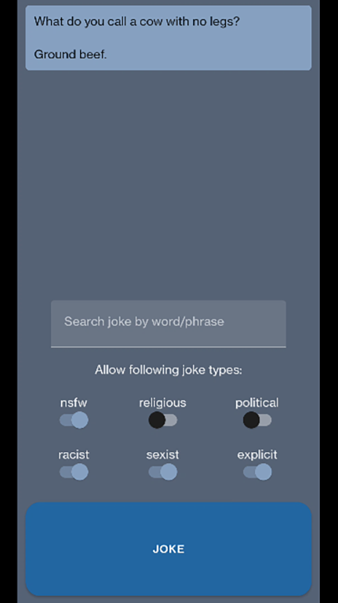
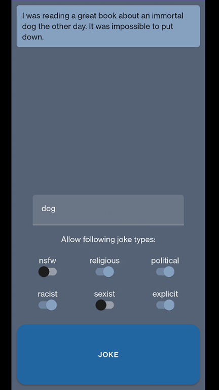
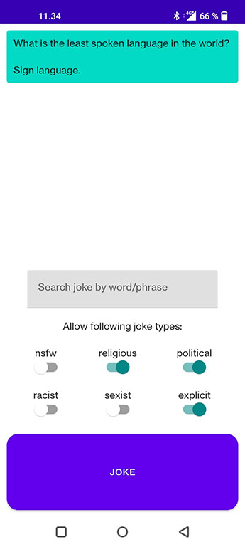

# Joke App

# Topic

Mobile application that shows random jokes.

App uses JokeAPI to get the jokes. (link: https://v2.jokeapi.dev/)

User will have the ability to search jokes that contain certain words.

User can choose to disable following types of jokes from appearing: nsfw, religious, political, racist, sexist or explicit.

# Author

Artur Haavisto

# Screenshots

# Target

Android/Kotlin

# Google Play link

https://play.google.com/store/apps/details?id=fi.tuni.tamk.tiko.haavisto.jokeapp

# Screencast

https://www.youtube.com/watch?v=aLDto04qGUk
